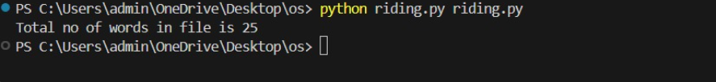

# Command--line-arguments-to-count-word
## AIM:
To write a python program for getting the word count from the contents of a file using command line arguments.
## EQUIPEMENT'S REQUIRED: 
PC
Anaconda - Python 3.7
## ALGORITHM: 
### Step 1:
Import sys module to use command line arguments.
### Step 2: 
 Create a file pointer and open the file which is passed in command line.
### Step 3: 
Initialize word count as zero.
### Step 4:  
For each line in file, split it into words and find number of the words in every line.
### Step 5: 
Sum the number of words in each line.
### Step 6: 
Display the total words in the file.
## PROGRAM:
```
Program to find Command--line-arguments-to-count-word
## Developed by: viswanadham venkata sai sruthi
## Register number: 212223100061
import sys
fp=open(sys.argv[1])
wordcount=0
for i in fp:
    words=i.split()
    wordcount+=len(words)
print("Total no of words in file is",wordcount)
fp.close()
```

### OUTPUT:





## RESULT:
Thus the program is written to find the word count from the contents of a file using command line arguments.
